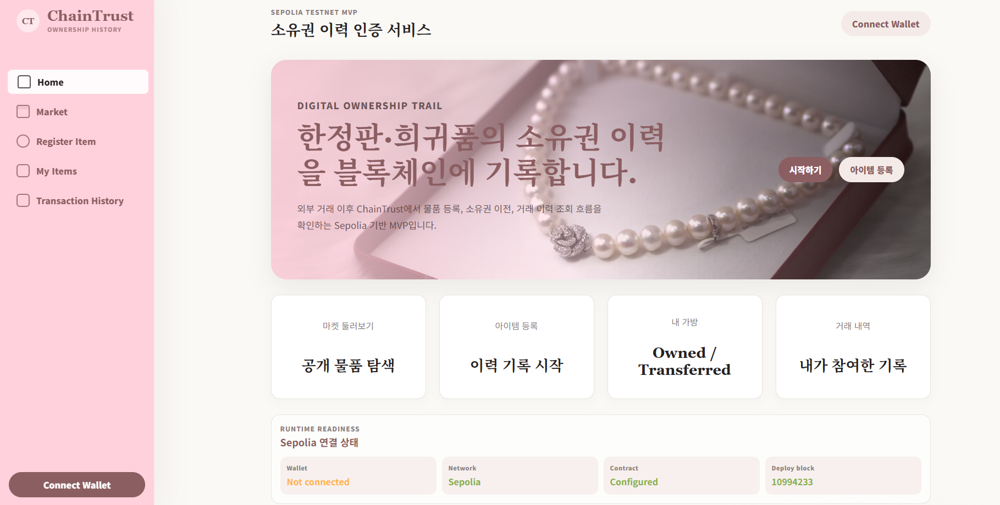
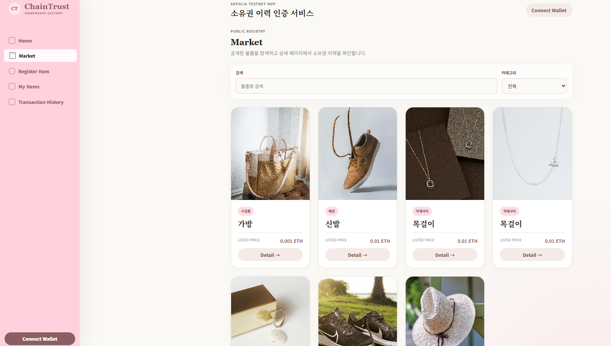
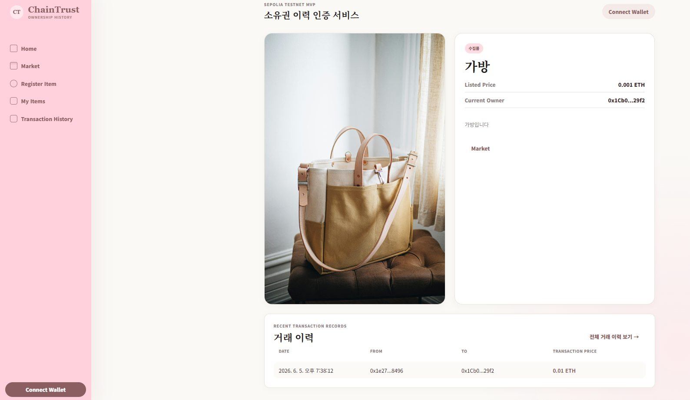

[🇰🇷 한국어 README](./README.md)

# ChainTrust

ブロックチェーンを活用した中古取引履歴管理サービス

## 1. プロジェクト概要

ChainTrustは、中古取引における商品の所有権移転履歴をブロックチェーン上に記録し、取引の信頼性向上を目的としたWebサービスです。

ユーザーはMetaMaskウォレットを接続し、商品を登録した後、取引完了時に別のウォレットアドレスへ所有権を移転できます。

登録および移転履歴はEthereum Sepolia Testnet上に記録され、ユーザーは商品の取引履歴を確認できます。

---

## 2. 開発背景

中古取引では、出品者が本当に商品の所有者であるか、また過去にどのような取引が行われたのかを確認することが難しいという課題があります。

ChainTrustは、改ざんが困難なブロックチェーンの特性を活用し、透明性の高い取引履歴管理を実現することを目的として開発しました。

### 開発プロセス

本プロジェクトは、AI支援開発ツールを積極的に活用して開発しました。

企画、画面設計、コード作成、デバッグ、ドキュメント作成の各工程でAIの支援を活用しました。

私自身は主に以下の業務を担当しました。

* サービス設計
* UI構成および画面実装
* MetaMask連携テスト
* 機能検証
* デプロイおよび発表資料作成

---

## 3. 主な機能

* MetaMaskウォレット接続
* ウォレットアドレスによるユーザー識別
* 商品登録
* 商品一覧表示
* 商品詳細表示
* 所有商品の管理
* ウォレットアドレスによる所有権移転
* 取引履歴確認
* Ethereum Sepolia Testnet上のスマートコントラクト連携

---

## 4. 技術スタック

### Frontend

* React
* JavaScript
* CSS
* Vite

### Blockchain

* Solidity
* Ethereum Sepolia Testnet
* MetaMask

### Deployment

* Vercel

---

## 5. 画面構成

| 画面                  | 説明                    |
| ------------------- | --------------------- |
| Home                | サービス紹介およびネットワーク接続状態確認 |
| Market              | 登録済み商品の閲覧・検索          |
| Register Item       | 商品登録                  |
| Detail              | 商品詳細および取引履歴確認         |
| My Items            | 所有商品一覧                |
| Transaction History | 取引履歴一覧                |
| Transfer            | 所有権移転                 |

### Home



サービス概要とブロックチェーンネットワークの接続状態を確認できます。

### Market



登録された商品を検索し、詳細ページへ移動できます。

### Detail



現在の所有者情報と取引履歴を確認できる主要画面です。

---

## 6. 実装内容

### MetaMask連携

Ethereumウォレットアドレスを利用してユーザー状態を管理しました。

ウォレット接続、切断、アカウント変更イベントを検知し、現在選択されているアカウントを基準としてサービスを利用できるよう実装しました。

### ブロックチェーン連携

Ethereum Sepolia Testnetへスマートコントラクトをデプロイし、MetaMaskを通じて商品登録および所有権移転を実行できるようにしました。

ユーザーが実行した操作はブロックチェーン上に記録され、取引履歴画面から確認できます。

### 所有権移転と履歴管理

商品の現在所有者のみが所有権を移転できるように実装しました。

所有権が移転されると、新しい所有者情報と移転履歴が保存され、商品の取引履歴を追跡できます。

---

## 7. トラブルシューティング

### 1. MetaMaskアカウント切り替え反映問題

MetaMaskでアカウントを変更しても、アプリ側のウォレットアドレスが即座に更新されない問題がありました。

MetaMaskのアカウント変更イベントを監視し、アプリの状態へ反映することで解決しました。

### 2. Sepoliaネットワーク判定問題

Sepoliaに接続しているにもかかわらず、「Wrong Network」と表示される問題が発生しました。

原因を調査した結果、chainIdの処理方式の違いによるものであることが判明しました。

ネットワーク情報の処理方法を統一することで解決しました。

---

## 8. 課題と今後の改善点

### 現在の課題

* 一人のユーザーが複数のウォレットを作成し、取引履歴を意図的に作成できる
* 出品者の信頼度や評価を確認する仕組みがない
* 出品者プロフィールを通じた総合的な取引履歴確認機能がない

### 今後の改善案

* 出品者プロフィール機能の追加
* レビュー・評価システムの導入
* ガス代と商品価格を分離し、日本円・韓国ウォンなど法定通貨表示に対応
* IPFSを利用した画像・メタデータ管理の改善

---

## 9. 学んだこと

本プロジェクトを通じて、Reactを用いたWebアプリケーションとMetaMask、スマートコントラクトを連携する一連の開発プロセスを経験しました。

また、ブロックチェーンは単なるデータ保存技術ではなく、「改ざんが困難な取引記録」を提供することで信頼性向上に活用できることを学びました。

さらに、ChatGPT、Codex、StitchなどのAIツールを活用しながら企画、実装、デバッグ、ドキュメント作成を進めることで、開発効率を向上させる経験ができました。

AIが生成したコードをそのまま利用するのではなく、動作確認や問題修正を繰り返すことで、新しい技術を短期間で学習・活用する力を身につけることができました。

---

## 10. 実行方法

```bash
npm install
npm run dev
```

---

## 11. リンク

* Service: https://used-market-302qqs-projects.vercel.app/
* GitHub: https://github.com/302qq/used_market
